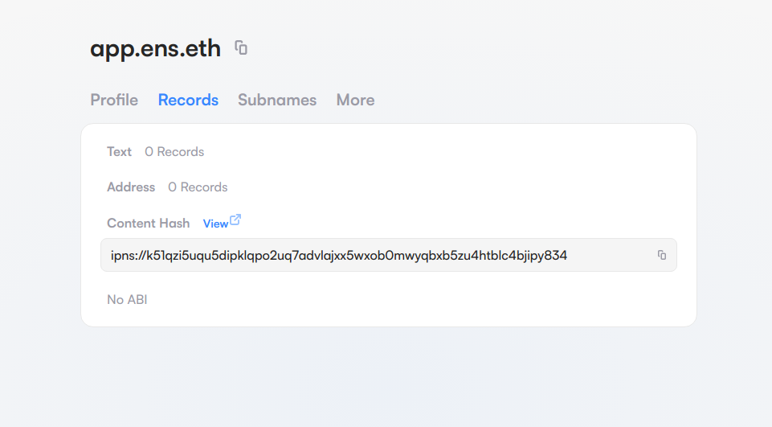
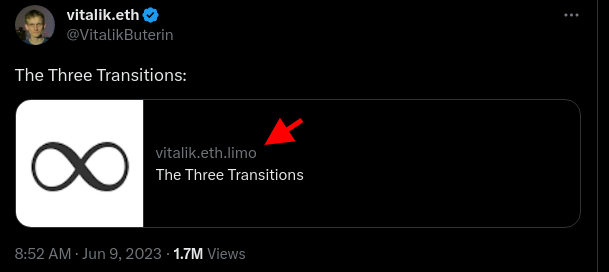
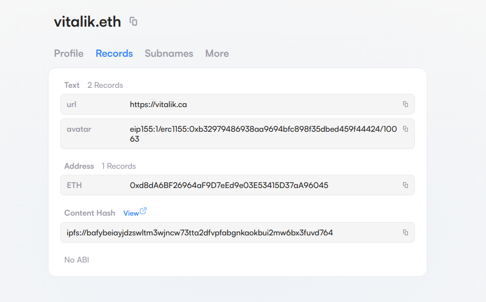
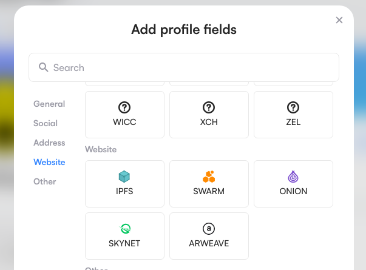
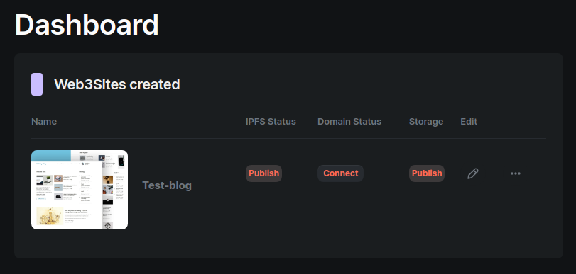
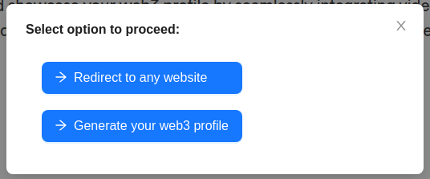

In 2018, the `contenthash` field was introduced in [ENSIP-7](https://docs.ens.domains/ens-improvement-proposals/ensip-7-contenthash-field). An ENSIP is an Ethereum Name Service Improvement Proposal that introduced this new field to allow ENS resolvers to map names to network and content addresses. This ENSIP actually began as an Ethereum Improvement Proposal, [EIP-1577](https://eips.ethereum.org/EIPS/eip-1577). ENS names can have this special record set, allowing developers and dapps to resolve content on a distributed system. In most cases this record is saved onchain, and is immutable in the sense that only the ENS name owner or manager can set records for the name.

Because the ENS name, `app.ens.eth`, has a `contenthash` record set, you can visit a decentralized version of the ENS Manager App stored on IPFS. The easiest way is to use the [eth.limo resolver](https://eth.limo/) by visiting [app.ens.eth.limo](https://app.ens.eth.limo) You can also use the [ENS Manager App](https://app.ens.domains/app.ens.eth?tab=records) to view the `contenthash` record for ENS names that have been set. 

When [Nick Johnson](https://twitter.com/nicksdjohnson) began working on the early concepts behind ENS, it was during his time at the [Ethereum Foundation](https://ethereum.org/en/foundation/) back in 2016. He was tasked with setting up a naming system for [Swarm](https://www.ethswarm.org/), a decentralized data storage and distribution technology. It was from this project that ENS was born. As the side project within the Ethereum Foundation grew, [Vitalik Buterin](https://twitter.com/VitalikButerin), the founder of Ethereum, gave a $1M grant for Nick to begin a company to develop the ENS protocol. if you'd like to learn more about how ENS began, check out [The Defiant](thedefiant.io) podcast interview below.

<Youtube src="2lU5YzI66aM" />

### Using an ENS name for a decentralized website ###

The ENS `contenthash` record currently supports these decentralized and distributed storage technologies: [Swarm](https://www.ethswarm.org/), [IPFS](https://www.ipfs.tech/), [Onion](https://www.torproject.org/), [Skynet](https://skynetlabs.com/) and [Arweave](https://www.arweave.org/). One of the most famous examples of using a decentralized website with an ENS name is Vitalik's blog, the founder of Ethereum. You can visit his blog which utilizes IPFS storage here: [vitalik.eth.limo](https://vitalik.eth.limo)

Currently, the `contenthash` record is set to the IPFS location:

`bafybeiayjdzswltm3wjncw73tta2dfvpfabgnkaokbui2mw6bx3fuvd764`

You can view the records for [vitalik.eth](https://app.ens.domains/vitalik.eth?tab=records) on the ENS Manager App as seen below:

Once you know the `contenthash` record for the ENS name, which can be found in ENS Manager App, you can use this hash to visit the decentralized website using IPFS Gateways.

https://ipfs.io/ipfs/bafybeiayjdzswltm3wjncw73tta2dfvpfabgnkaokbui2mw6bx3fuvd764
https://bafybeiayjdzswltm3wjncw73tta2dfvpfabgnkaokbui2mw6bx3fuvd764.ipfs.dweb.link/

Here is a list of public [IPFS gateway providers](https://docs.ipfs.tech/concepts/ipfs-gateway/#gateway-providers).

There are a few browsers that you can type in name.eth and it will visit the decentralized website by automatically reading the IPFS hash. Two popular browsers that have this functionality built in are [Brave Browser](https://brave.com) and [Opera](https://opera.com). Additionally, browsers that have [Metamask](https://metamask.io) installed can resolve .eth ENS names right from the browser.

### How can I store the location of decentralized content in the ENS content record? ###

Storing content on a decentralized website involves uploading the content to a distributed storage network like IPFS. Popular uploading and pinning services that use the IPFS network are [Pinata](https://www.pinata.cloud/), [Web3 Storage](https://web3.storage/), [Lighthouse](https://www.lighthouse.storage/), and [Filebase](https://filebase.com/). You can also run your own node of IPFS  your local computer, like with [IPFS Desktop](https://docs.ipfs.tech/install/ipfs-desktop/). Using IPFS content addresses is one type of `contenthash` record. As mentioned, you can also use Swarm, Onion, Skynet, and Arweave locations. Content records you want to associate with your ENS name can be configured by logging into the [ENS Manager App](https://app.ens.domains) with the wallet that owns or manages your ENS name.

> For help on adding the content hash to your ENS records, see the support docs: [Configure the ENS name content hash record](https://support.ens.domains/articles/7890637-create-a-decentralized-website#h_aeeb903a9a)

### How do you build a simple decentralized website without knowing how to code? ###

ENS is an open protocol anyone can build on. One way to create a decentralized website using your ENS name is to use a no-code website builder like [1W3](https://1w3.eth.limo/). The developers of this tool make it easy to create a decentralized websites that function on both Arweave and IPFS. To do that, you would simply log into this project's dApp with your wallet that has permission to update your ENS records. 1W3 can be a great tool for building decentralized linktr.ee type websites. Their no-code builder takes care of uploading and pinning the content to IPFS automatically.

### Redirecting an ENS name to an existing DNS domain ###

Maybe you have a regular *.com* website for example, and haven’t built a decentralized version of it yet. One thing you can do if you have an ENS name is to just redirect it to your website address. This way if someone goes to mycooltshirts.eth.limo, the content record can be used with a redirect file that is automatically generated for you through their tool. This file is stored on IPFS, and that location is set in the `contenthash` record. To give it a try, visit [ENSRedirect](https://ensredirect.xyz/).

### Building a custom decentralized website ###

Developers can deploy custom coded websites on supported distributed storage networks that the ENS `contenthash` record supports. For a guide on using [Fleek](https://fleek.co/) and a no-code builder tool for customized template using [Heaven's Tools](https://heavens.tools/) see: [ENS Support Docs - Creating A Decentralized Website](https://support.ens.domains/articles/7890637-create-a-decentralized-website#h_e0347613ca)

Another appraoch involves using popular static site generators such as [Gatsby](https://gatsbyjs.com), [Hugo](https://gohugo.io), [Jekyll](https://jekyllrb.com), or [Eleventy](https://11ty.dev). These generators will allow you to develop a website locally, and then it will generate the entire static website for you which you can then upload to IPFS.
